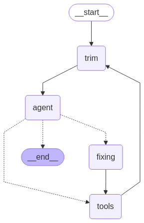

## Open WebUI LangGraph Agent

This is an example of how to use a LangGraph ReAct Agent to provide service for Open WebUI. The structure of this project is:

- Entry: `fastapi_server.py`, accepting requests and invoke the graph
- The graph:

  
- When the agent finishes calling tools and start to provide final answers, it yields SSE messages token by token to upstream.

The fixing node is a silly attempt in handling invalid tool calls resulting from calling a tool that accepts only one optional parameter, like `get_current_time` in `tool_time.py`. If the model decides to call the tool without any parameter, it will generate `"args": None`, but pydantic requires `args` to be a dict. That's why it will become an invalid tool call, and the current solution is to *made up* a tool call with `"args": {}`.

`globalresource.py` provides many things, from chat model to vector store. It also holds tokenizer of the main model, so that other components can use it to estimate token counts. My backend is vLLM.

## Credit

- [Openwebui Pipelines](https://github.com/open-webui/pipelines)
- [LangChain](https://www.langchain.com)
